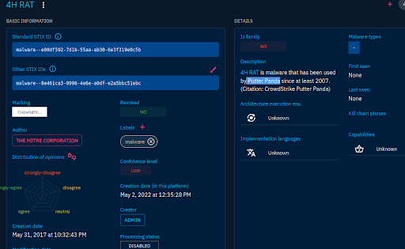
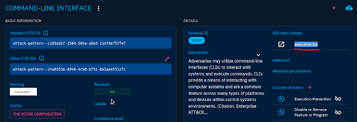
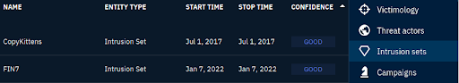
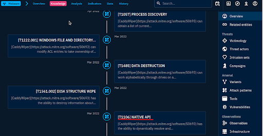
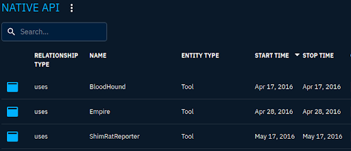
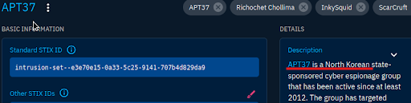

# 🧠 OpenCTI Threat Intelligence Investigation Lab

This GitHub project documents a hands-on investigation using the **OpenCTI platform** to analyze malware, intrusion sets, attack techniques, and indicators. The investigation simulates a real-world SOC/CTI analyst workflow.

---

## 📂 Contents

### 🔬 Investigations & Analysis

- [`4h_rat_to_actor.md`](./4h_rat_to_actor.md)  
  ➤ Mapping 4H RAT to Putter Panda (threat actor linkage)

- [`command_line_interface.md`](./command_line_interface.md)  
  ➤ MITRE technique: Execution-ICS (T0807)
  

- [`cobalt_strike.md`](./cobalt_strike.md)  
  ➤ Intrusion Sets: CopyKittens, FIN7 + Author Attribution (MITRE)

- [`caddywiper.md`](./caddywiper.md)  
  ➤ Earliest activity (2022/03/15), execution technique: Native API
  

- [`native_api.md`](./native_api.md)  
  ➤ Malware relations count (113), 2016 tools: BloodHound, Empire, ShimRatReporter
 

- [`apt37.md`](./apt37.md)  
  ➤ Country: North Korea, Initial Access Techniques: T1189, T1566
  

- [`mitre_mapping.md`](./mitre_mapping.md)  
  ➤ Summary of MITRE ATT&CK TTPs and Kill Chain mappings used in this lab

---

## 🛠️ Tools & Skills Demonstrated
- OpenCTI navigation: Malware, Intrusion Sets, Techniques, Reports
- MITRE ATT&CK Matrix (Enterprise & ICS)
- STIX2 relationships & kill chain analysis
- IOC location and filtering
- Confidence level assessment
- Timeline filtering by year (historical tool usage)

---

## 📈 Why This Project Matters
This project demonstrates:
- Real-world investigative workflows
- CTI tooling beyond just reading reports
- Analyst decision-making (not just answer-hunting)
- Professional communication of findings

> Built by a junior analyst preparing for SOC + CTI roles. This repo serves as both a **learning journal** and a **portfolio artifact**.

---

## 📸 Screenshots (See `/screenshots` folder)
- Cobalt Strike linked intrusion sets
- Native API usage by tools (2016 filter)
- APT37 MITRE mapping
- CaddyWiper timeline view

---

## 📌 Credits
- Threat intel source: OpenCTI Platform
- Lab flow inspired by: TryHackMe OpenCTI room
- MITRE ATT&CK® framework for technique references

---

### 👀 Want to learn more?
See the accompanying blog post at: `[BlogPost](https://www.virginianelai.com/blog/opencti-threat-intelligence-lab)`

Connect with me on [LinkedIn](https://www.linkedin.com/in/virginianelai) or view more projects at `[My Projects](https://www.virginianelai.com/projects)`
