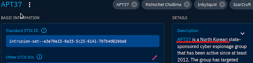

# 🎯 APT37 — Country Attribution & Initial Access Techniques

## 🔍 Objective
Investigate the **APT37** intrusion set in OpenCTI to:
1. Identify the **country** associated with the group
2. List **initial access techniques** used by the group

## 🧪 Steps Taken
### Part 1: Country Attribution
1. Searched for `APT37` in OpenCTI.
2. Selected the entity labeled as `Intrusion Set`.
3. On the **Overview tab**, found the country attribution: **North Korea**

✅ **Country**: North Korea

### Part 2: Initial Access Techniques
1. Navigated to the **Knowledge tab** → `Attack Patterns`
2. Viewed the **MITRE ATT&CK matrix** presented within OpenCTI.
3. Focused on the `Initial Access` column of the matrix.
4. Identified two highlighted techniques:
   - **T1189** — Drive-by Compromise
   - **T1566** — Phishing

✅ **Initial Access Techniques**: T1189 (Drive-by), T1566 (Phishing)

## 📈 What This Shows
- Demonstrates attribution analysis using threat intel platforms
- Shows ability to filter techniques by tactic (Initial Access)
- Reinforces platform fluency with ATT&CK matrix and threat group profiles

## 🖼️ Screenshot

