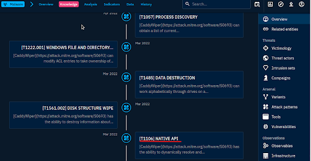

# 🧹 CaddyWiper — Timeline & Execution Technique Analysis

## 🔍 Objective
Investigate the **CaddyWiper** malware in OpenCTI to determine:
1. The **earliest recorded date** related to the malware
2. The **execution technique** it uses

## 🧪 Steps Taken
### Part 1: Earliest Recorded Date
1. Searched for `CaddyWiper` and selected the `Malware` entity.
2. Checked the **Overview tab** and noted metadata fields:
   - Platform creation date: May 2, 2022
   - Entity creation date: March 23, 2022
3. Switched to the **Analysis tab** and reviewed linked reports.
4. Found a report titled **ESET - CaddyWiper (March 2022)**
5. Opened the report and confirmed an earlier date: **March 15, 2022**

✅ **Earliest date recorded**: `2022/03/15`

### Part 2: Execution Technique
1. From the Knowledge tab, viewed the **MITRE ATT&CK timeline**.
2. Located the execution technique mapped to CaddyWiper.
3. Identified: **Native API** as the primary execution method.

✅ **Execution Technique**: Native API

## 📈 What This Shows
- Ability to cross-reference entity metadata with timeline and report data
- Realistic analyst workflow: verify rather than assume
- Understanding of evasive execution methods (e.g., Native API)

## 🖼️ Screenshot

