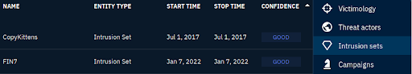

# 🧨 Cobalt Strike — Threat Group Mapping & Attribution

## 🔍 Objective
Investigate the **Cobalt Strike** malware in OpenCTI to identify:
1. Associated intrusion sets (with good confidence)
2. Author/source of the entity

## 🧪 Steps Taken
1. Searched for `Cobalt Strike` in OpenCTI’s global search.
2. Selected the `Malware` entity to open the detail view.
3. On the **Knowledge tab**, reviewed the **Intrusion Sets** section:
   - Checked confidence levels linked to each group.
4. Identified two intrusion sets with **good (high) confidence**:
   - **CopyKittens**
   - **FIN7**
5. Switched to the **Analysis tab** to check metadata and source information.
6. Found the **Author** listed as: **MITRE Corporation**

## 🔗 Key Relationships
- **Malware**: Cobalt Strike
- **Intrusion Sets**: CopyKittens, FIN7
- **Author**: MITRE Corporation

## 📈 What This Shows
- Ability to trace malware to active threat groups using OpenCTI
- Understanding of how **confidence levels** influence threat intel reliability
- Analyst skill in confirming **source attribution** for threat entities

## 🖼️ Screenshot

