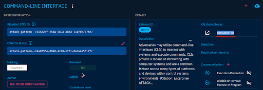

# 🖥️ Command-Line Interface (CLI) — MITRE Technique Mapping

## 🔍 Objective
Determine which **kill chain phase** is associated with the `Command-Line Interface` attack pattern in OpenCTI.

## 🧪 Steps Taken
1. Searched for `Command-Line Interface` in OpenCTI.
2. Identified two MITRE techniques:
   - `T1609` (Enterprise matrix)
   - `T0807` (ICS matrix)
3. Initially assumed it was part of the **Command and Control** phase — but after reading closely, realized it refers to **execution**.
4. Opened the **T0807** technique entity and confirmed the **Kill Chain Phase**: `execution-ics`

## 🧠 Reflection
> I originally saw the word “command” and jumped to **Command and Control**, but missed the full label: **Command-Line Interface**. Once I noticed the full term, it made sense — CLI is used to run scripts and commands, not control external systems. This moment reinforced the importance of reading carefully and thinking like an analyst.

## 📈 What This Shows
- Familiarity with MITRE ATT&CK matrices (Enterprise vs ICS)
- Ability to interpret **kill chain phases** accurately
- Growth in analytical mindset through correction and clarification

## 🖼️ Screenshot

