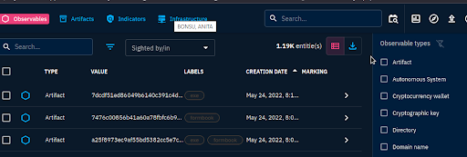

# 🧩 IOC Handling — Where Indicators Live in OpenCTI

## 🔍 Objective
Understand where **Indicators of Compromise (IOCs)** are stored and accessed in the OpenCTI platform.

## 🧪 Steps Taken
1. Reviewed the **Activities** section in OpenCTI’s left-hand navigation panel.
2. Explored the three sub-tabs:
   - `Analysis`
   - `Events`
   - `Observations`
3. Focused on the **Observations tab**, which lists:
   - Technical artifacts like IP addresses, file hashes, domains
   - Detection rules and behaviors tied to threat activity

✅ IOC data is located in the **Observations tab** under the `Activities` section.

## 📈 What This Shows
- IOCs are treated as **technical evidence** within OpenCTI
- Observations provide analysts a way to correlate local detections with broader threat intelligence
- Knowing where to find IOCs supports threat hunting and detection engineering workflows

## 🖼️ Screenshot

